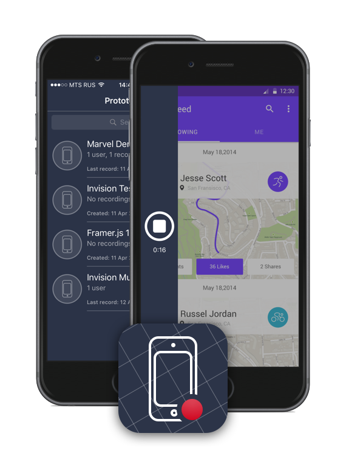
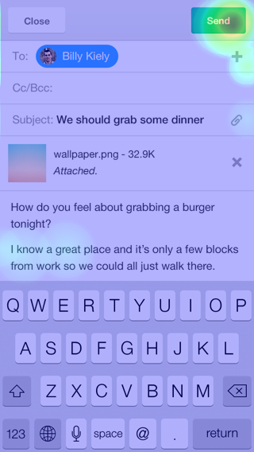

# Habco

Here is my diploma project for bachelor degree. 

Habco lets you to record interaction with prototypes on your iPhone. If you have web-based prototype, made with, for example, Invision, Marvel, Framer.js or Atomic.io (other services are supported too), then you can start testing them with Habco.

## How to use it?

- Add your prototype to Habco
- Add testers to prototype
- Give them your device and start recording

As the result you will get a video similar to the following.

[Youtube link](https://youtu.be/t_zw9FiKGaQ)

And also heat maps for screens in your prototype:

